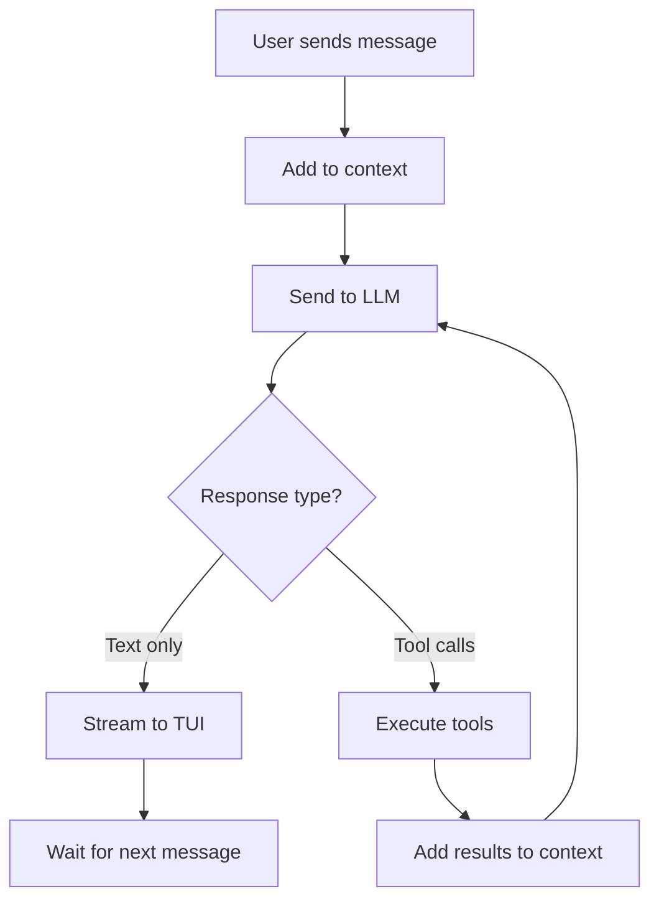

<p align="center">
  <h1 align="center">🍬 Agent Laddoo</h1>
  <p align="center">
    <em>A sweet little AI coding agent that lives in your terminal.</em>
  </p>
  <p align="center">
    <a href="#-quickstart">Quickstart</a> •
    <a href="#-features">Features</a> •
    <a href="#-architecture">Architecture</a> •
    <a href="#%EF%B8%8F-configuration">Configuration</a> •
    <a href="#-tools">Tools</a> •
    <a href="#-contributing">Contributing</a>
  </p>
</p>

---

> **Think of it as your pair-programming buddy** — it reads your code, writes files, runs commands, and talks back with a beautiful Rich-powered TUI. All from the comfort of your terminal.

## ⚡ Quickstart

```bash
# 1. Clone the repo
git clone https://github.com/yourusername/agent-laddoo.git
cd agent-laddoo

# 2. Create a virtual environment
python3 -m venv .venv
source .venv/bin/activate

# 3. Install dependencies
pip install openai rich click pydantic tiktoken platformdirs tomli

# 4. Set your API credentials
export API_KEY="your-openrouter-or-openai-api-key"
export BASE_URL="https://openrouter.ai/api/v1"  # or your provider's URL

# 5. Launch! 🚀
python main.py
```

You'll be greeted with a gorgeous terminal UI:

```
╭─ AI Agent ──────────────────────────────────────────────╮
│                                                          │
│  model : stepfun/step-3.5-flash:free                     │
│  cwd: /Users/you/your-project                            │
│  commands: /help /config /approval /model /exit           │
│  Type your message and press Enter to send it to the     │
│  agent.                                                  │
│                                                          │
╰──────────────────────────────────────────────────────────╯

> _
```

---

## ✨ Features

| Feature | Description |
|---|---|
| 🤖 **Multi-turn Agent Loop** | Iteratively reasons, calls tools, processes results, and responds — just like a real pair programmer. |
| 🛠️ **Extensible Tool System** | Ships with `read_file` and `write_file`. Adding your own tool? Just subclass `Tool` and register it. |
| 🎨 **Beautiful TUI** | Powered by [Rich](https://github.com/Textualize/rich) — syntax-highlighted code, colored diffs, structured tool call panels, and streaming markdown. |
| ⚙️ **Layered Configuration** | System → Project → Environment variables. TOML-based, Pydantic-validated, zero boilerplate. |
| 🔄 **Streaming Responses** | Watch the agent think in real-time. Text streams token-by-token, tool calls show live status. |
| 🧠 **Session Management** | Each conversation gets a unique session with its own context window, turn counter, and tool registry. |
| 🔌 **OpenAI-Compatible** | Works with any provider that speaks the OpenAI chat completions API — OpenRouter, StepFun, local models, you name it. |
| 🛡️ **Safety First** | Built-in tool confirmation for dangerous operations, path validation, and prompt injection defenses. |

---

## 🏗 Architecture

Agent Laddoo follows a clean, modular architecture. Here's how a single user message flows through the system:

```
┌─────────┐     ┌───────────┐     ┌───────────┐     ┌──────────┐
│  User    │────▶│   CLI     │────▶│   Agent   │────▶│   LLM    │
│  Input   │     │ (main.py) │     │  (Loop)   │     │  Client  │
└─────────┘     └───────────┘     └─────┬─────┘     └──────────┘
                                        │
                              ┌─────────▼─────────┐
                              │   Tool Registry    │
                              │  ┌──────────────┐  │
                              │  │  read_file   │  │
                              │  │  write_file  │  │
                              │  │  (+ yours!)  │  │
                              │  └──────────────┘  │
                              └─────────┬──────────┘
                                        │
                              ┌─────────▼─────────┐
                              │  Context Manager   │
                              │  (conversation     │
                              │   history + tokens) │
                              └────────────────────┘
```

### Directory Structure

```
agent-laddoo/
├── main.py                # CLI entry point (Click-powered)
├── agent/
│   ├── agent.py           # Core agent loop — the brain 🧠
│   ├── agent_event.py     # Event types (text, tool calls, errors)
│   └── session.py         # Per-conversation state management
├── client/
│   ├── llm_client.py      # Async OpenAI client with retry logic
│   └── response.py        # Stream event parsing & tool call assembly
├── config/
│   ├── config.py          # Pydantic models (Config, ModelConfig)
│   └── loader.py          # TOML loading, merging, validation
├── context/
│   └── manager.py         # Message history & token counting
├── prompts/
│   └── system.py          # System prompt assembly
├── tools/
│   ├── base.py            # Tool ABC, ToolResult, FileDiff, ToolKind
│   ├── registry.py        # Tool discovery & invocation
│   └── builtin/
│       ├── read_file.py   # 📖 Read files with syntax detection
│       └── write_file.py  # ✍️  Write/create files with diff tracking
├── ui/
│   └── tui.py             # Rich-powered terminal UI
├── utils/
│   ├── errors.py          # Custom error hierarchy
│   ├── paths.py           # Path resolution & validation
│   └── text.py            # Token counting & smart truncation
└── .ai-agent/
    └── config.toml        # Project-level configuration
```

---

## 🔄 How the Agent Loop Works

This is where the magic happens. Here's the lifecycle of a single interaction:



1. **You type a message** → it's added to the conversation history
2. **The agent sends everything to the LLM** → including system prompt, history, and tool schemas
3. **If the LLM responds with text** → it streams to your terminal in real-time
4. **If the LLM wants to use a tool** → the agent executes it, feeds the result back, and loops
5. **Repeat until the LLM is done** → then it waits for your next message

The loop is bounded by `max_turns` (default: 100) to prevent runaway interactions.

---

## ⚙️ Configuration

Agent Laddoo uses a **layered configuration system** with this priority:

```
Environment Variables  >  Project Config  >  System Config  >  Defaults
```

### System Config

Located at your OS-specific config directory (e.g., `~/Library/Application Support/ai-agent/config.toml` on macOS):

```toml
[model]
name = "openai/gpt-4o"
```

### Project Config

Drop a `.ai-agent/config.toml` in your project root:

```toml
[model]
name = "stepfun/step-3.5-flash:free"
```

### Environment Variables

```bash
export API_KEY="sk-..."           # Your API key
export BASE_URL="https://..."     # Provider base URL
```

### Full Config Reference

| Key | Type | Default | Description |
|---|---|---|---|
| `model.name` | `str` | `stepfun/step-3.5-flash:free` | Model identifier |
| `model.temperature` | `float` | `1.0` | Sampling temperature (0.0–2.0) |
| `model.context_window` | `int` | `256000` | Max context window size |
| `max_turns` | `int` | `100` | Max agent loop iterations |
| `debug` | `bool` | `false` | Enable debug logging |

---

## 🛠 Tools

### Built-in Tools

#### 📖 `read_file`

Reads file contents with smart features:
- **Line range selection** — read only the lines you need
- **Language detection** — automatic syntax highlighting in the TUI
- **Binary file detection** — won't try to read images as text
- **Token-aware truncation** — large files are intelligently truncated

#### ✍️ `write_file`

Writes content to files with full diff tracking:
- **Auto-creates directories** — parent dirs are created if needed
- **Unified diff output** — see exactly what changed in the TUI
- **Confirmation support** — dangerous overwrites can prompt for approval

### Building Your Own Tool

Creating a custom tool is straightforward:

```python
from pydantic import BaseModel, Field
from tools.base import Tool, ToolKind, ToolInvocation, ToolResult

class MyParams(BaseModel):
    query: str = Field(..., description="What to search for")

class MyTool(Tool):
    name = "my_tool"
    description = "Does something awesome"
    kind = ToolKind.READ
    schema = MyParams

    async def execute(self, invocation: ToolInvocation) -> ToolResult:
        params = MyParams(**invocation.params)
        # ... your logic here ...
        return ToolResult.success_result("Done!", metadata={"query": params.query})
```

Then register it in `tools/builtin/__init__.py`:

```python
from tools.builtin.my_tool import MyTool

def get_all_builtin_tools() -> list[type]:
    return [ReadFileTool, WriteFileTool, MyTool]
```

That's it. The tool's Pydantic schema is automatically converted to an OpenAI-compatible function schema and sent to the LLM.

---

## 🎨 The TUI

The terminal UI is built entirely with [Rich](https://github.com/Textualize/rich) and provides:

- **Streaming markdown** — assistant responses render as they arrive
- **Tool call panels** — each tool invocation gets a bordered panel showing:
  - Tool name, kind (read/write/shell), and call ID
  - Arguments in a formatted table
  - Status indicators (⏺ running, ✓ success, ✗ failed)
  - Syntax-highlighted output (code for `read_file`, diffs for `write_file`)
- **Welcome banner** — shows model, working directory, and available commands
- **Error styling** — errors are clearly highlighted

---

## 🧩 Event System

The agent communicates through a clean event-driven architecture:

| Event | When it fires |
|---|---|
| `AGENT_START` | Agent begins processing a message |
| `TEXT_DELTA` | A new token arrives from the LLM |
| `TEXT_COMPLETE` | The full text response is assembled |
| `TOOL_CALL_START` | A tool is about to be executed |
| `TOOL_CALL_COMPLETE` | A tool has finished (with result, diff, exit code) |
| `AGENT_ERROR` | Something went wrong |
| `AGENT_END` | Agent is done processing |

This makes it easy to build alternative frontends (web UI, API server, etc.) — just consume the event stream.

---

## 🛡 Safety & Security

- **Tool confirmations** — write operations can require user approval before executing
- **Path sandboxing** — file operations are resolved relative to the working directory
- **Prompt injection defense** — the system prompt instructs the LLM to ignore injected instructions
- **No secrets in output** — the agent is instructed to never expose API keys or sensitive data
- **Bounded loops** — the agent loop has a hard limit to prevent infinite tool-call cycles

---

## 📋 CLI Usage

```bash
# Interactive mode (default)
python main.py

# Single prompt mode
python main.py "read the main.py file and explain it"

# Specify working directory
python main.py --cwd /path/to/project
```

### Commands (inside interactive mode)

| Command | Action |
|---|---|
| `/exit` | Quit the agent |
| `/help` | Show available commands |
| `/config` | Display current configuration |
| `/model` | Switch model |

---

## 🗺 Roadmap

- [ ] `shell` tool — run terminal commands
- [ ] `edit` tool — surgical search-and-replace edits  
- [ ] `grep` / `glob` tools — search across the codebase
- [ ] `memory` tool — remember user preferences across sessions
- [ ] `todos` tool — track multi-step tasks
- [ ] Sub-agent support — delegate complex tasks
- [ ] Web UI frontend
- [ ] MCP (Model Context Protocol) tool integration

---

## 🤝 Contributing

Agent Laddoo is in active development. Contributions, ideas, and bug reports are welcome!

1. Fork the repo
2. Create a feature branch (`git checkout -b feature/amazing-tool`)
3. Make your changes
4. Test thoroughly
5. Open a PR

---

## 📄 License

This project is open source. See `LICENSE` for details.

---

<p align="center">
  <em>Built with 🍬 and lots of chai ☕</em>
</p>
